<!-- Generated by GitHub Profile Agent Console. Edit profile.config.json, then run npm run generate. -->

  <picture>
    <source media="(max-width: 760px) and (prefers-color-scheme: dark)" srcset="./assets/hero/agent-console-c9ae396e-mobile-dark.svg">
    <source media="(max-width: 760px)" srcset="./assets/hero/agent-console-c9ae396e-mobile-light.svg">
    <source media="(prefers-color-scheme: dark)" srcset="./assets/hero/agent-console-c9ae396e-dark.svg">
    <source media="(prefers-color-scheme: light)" srcset="./assets/hero/agent-console-c9ae396e-light.svg">
    
  </picture>

  

## About Me

Computer Science and IT Education student with a strong focus on full-stack web development.

I specialize in designing relational database architectures, developing robust backend logic, and building interactive user interfaces.

## Current Focus

| Area | What I am exploring |
| --- | --- |
| **Backend Arch** | Designing Entity-Relationship Diagrams (ERDs) and developing secure backend systems using PHP and Laravel. |
| **Interactive UI** | Implementing responsive frontend architectures utilizing JavaScript, HTML, and CSS. |
| **System Admin** | Building integrated platforms to efficiently manage data for large-scale operations. |

## Featured Work

| Project | Focus | Why it matters |
| --- | --- | --- |
| [**BAAK Polnest**](https://github.com/Bayu274/BAAK-PolNest) | Backend & Integration | An integrated administration platform built with PHP to manage activity data seamlessly. |
| [**HMP Mikroptik**](https://github.com/Bayu274/HMP-Mikroptik) | Frontend & UI | Official interactive digital platform for the Student Association featuring modern UI interactions. |
| [**RAB Calculator**](https://github.com/Bayu274) | Full-Stack System | A web-based calculator utilizing real-time price indexing for automated construction cost calculations. |

## Research Direction

I am interested in building efficient web applications from the ground up, focusing on pragmatic software engineering, optimal data flow, and responsive user experiences.

## Tech Stack

`PHP` · `JavaScript` · `Laravel` · `MySQL` · `Bootstrap` · `HTML & CSS` · `SQLite`

## Recent Activity

<!-- AUTO:ACTIVITY:START -->
- Jul 22, 2026: created a branch in [Bayu274/HMP-Mikroptik](https://github.com/Bayu274/HMP-Mikroptik).
- Jul 22, 2026: pushed 1 commit to [Bayu274/HMP-Mikroptik](https://github.com/Bayu274/HMP-Mikroptik).
- Jul 22, 2026: pushed 1 commit to [Bayu274/BAAK-PolNest](https://github.com/Bayu274/BAAK-PolNest).
- Jul 17, 2026: pushed 1 commit to [Bayu274/BAAK-PolNest](https://github.com/Bayu274/BAAK-PolNest).
- Jul 15, 2026: pushed 1 commit to [Bayu274/Bayu274](https://github.com/Bayu274/Bayu274).
- Jul 15, 2026: created a branch in [Bayu274/Bayu274](https://github.com/Bayu274/Bayu274).
<!-- AUTO:ACTIVITY:END -->

---

  Building high-performance systems and interactive user experiences.

